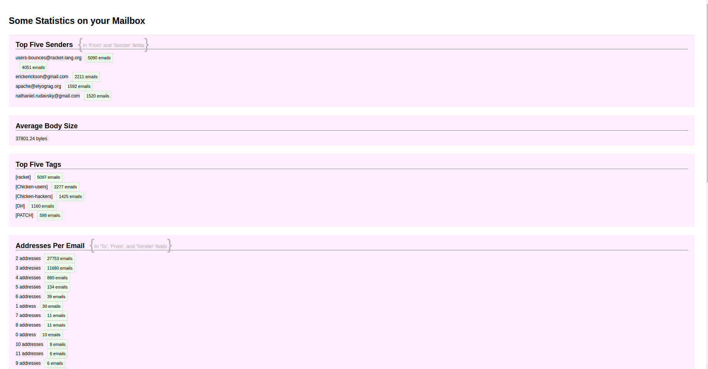

# mailstats

Super-simple, not-very-safe mini app to get some basic statistics from a Gmail mailbox, after Oauth.

## Prerequisites

You will need Clojure 1.8.0 and [Leiningen][] 2.0.0 or above installed.

[leiningen]: https://github.com/technomancy/leiningen

## Running

To run, simply use Leiningen to start a web server in the project directory:

    lein ring server

A browser will open at [http://localhost:3000](http://localhost:3000) where you will be invited to authorize a Gmail account.

## Structure

Basic config and routes are defined in `src/mailstats2/handler.clj`.

The homemade map-reduce function and configurable stats rules are defined in `src/mailstats2/stats.clj`.

## Notes

Users are assumed to be uniquely identified by email address.

Email bodies are not sent to the RDF store, as I've been testing with my private email.

RDF data is inserted into the the named graph `<http://tenforce.example.com/nathaniel>` at  `http://5.9.241.51:8890/sparql`.

There's very little in way of error handling, so a lot can go wrong. Weekends are short.

And everything is done in memory, so there's definitely an upper limit to mailbox size this app can handle.

## Screenshot

